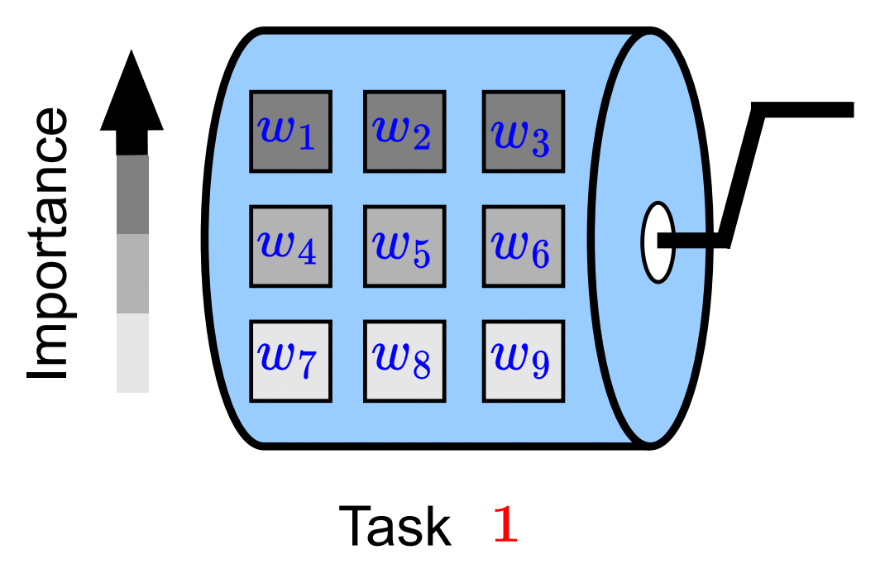

<div align="center">


# [ScrollNet: Dynamic Weight Importance for Continual Learning](http://arxiv.org/abs/2308.16567)

<div align="left">

# Introduction
The official Pytorch implementation for ScrollNet: Dynamic Weight Importance for Continual Learning, Visual Continual Learning workshop, ICCV 2023.

# Installation
## Clone this github repository
```
git clone https://github.com/FireFYF/ScrollNet.git
cd ScrollNet
```
## Create a conda enviroment
```
conda env create --file env.yml --name ScrollNet
```
*Notice:* set the appropriate version of your CUDA driver for `cudatoolkit` in `env.yml`.
## Environment activation/deactivation
```
conda activate ScrollNet
conda deactivate
```

# Launch experiments

## Run with ScrollNet-FT
```
python -u src/main_incremental.py --gpu 0 --approach finetuning --results-path ./results/5splits/scrollnet_ft --num-tasks 5
```
## Run with ScrollNet-LWF
```
python -u src/main_incremental.py --gpu 0 --approach lwf --results-path ./results/5splits/scrollnet_lwf --num-tasks 5
```
## Run with ScrollNet-EWC
```
python -u src/main_incremental.py --gpu 0 --approach ewc --results-path ./results/5splits/scrollnet_ewc --num-tasks 5
```

# Tune the number of subnetworks
Please modify the file 'SizeOfSubnetworks.yml'. The default setting is for 4 subnetworks with equal splitting (ScrollNet-4).  

# Acknowledgement
The implementation is based on [FACIL](https://github.com/mmasana/FACIL), which was developed as a framework based on class-incremental learning. We suggest referring to it if you want to incorporate more CL methods into ScrollNet.

# Cite
If you find this work useful for your research, please cite:
```bibtex
@misc{yang2023scrollnet,
    title={ScrollNet: Dynamic Weight Importance for Continual Learning},
    author={Fei Yang and Kai Wang and Joost van de Weijer},
    year={2023},
    eprint={2308.16567},
    archivePrefix={arXiv},
    primaryClass={cs.CV}
}
```
